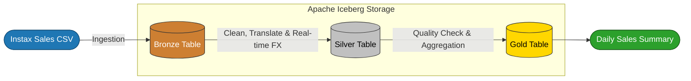

# Instax Sales Data Lakehouse: End-to-End ELT Pipeline

[](https://airflow.apache.org/)
[](https://spark.apache.org/)
[](https://iceberg.apache.org/)
[](https://www.docker.com/)

## 1. Project Overview
This project implements an automated **End-to-End Data Lakehouse Pipeline** designed to process Instax sales transaction data from Indonesia. The system transforms raw, localized data into business-ready insights for the Thai market, calculated in Thai Baht (THB).

**Why this project?**
* **Scalability:** Handles new categories and payment methods via AI-powered auto-translation.
* **Modern Data Stack:** Leverages **Apache Iceberg** for high-performance table management, supporting Time Travel and Partitioning.
* **Automation:** Orchestrated via **Apache Airflow** with a user-friendly parameter system (Date Picker).

---

## Dataset
The dataset utilized in this project is the **Fujifilm Instax Sales Transaction Data (Synthetic)**, sourced from Kaggle.

* **Source:** [Kaggle - Fujifilm Instax Sales Transaction Data](https://www.kaggle.com/datasets/bertnardomariouskono/fujifilm-instax-sales-transaction-data-synthetic)
* **Description:** This synthetic dataset contains 10,000 records of Instax sales transactions. It includes attributes such as transaction dates, product categories, product names, store locations (in Indonesia), payment methods, and sales quantities.
* **Context:** The raw data is localized for the Indonesian market (Indonesian language and IDR currency), providing an excellent scenario for demonstrating our pipeline's automated translation and financial conversion capabilities.


---

## 2. System Architecture
The project follows the **Medallion Architecture** (Bronze, Silver, Gold) using an **ELT (Extract, Load, Transform)** pattern to ensure a reliable Source of Truth in the Bronze layer.

## Data Pipeline Architecture



---

## 3. Project Structure & Environment
The directory is structured to ensure seamless deployment within a Dockerized environment:
```bash
instax-elt-pipeline/
│
├── dags/
│   └── instax_sales_pipeline.py         # Airflow DAG orchestration & runtime parameters
│    
├── scripts/
│   ├── elt_bronze_stage.py              # Raw CSV ingestion → Iceberg Bronze layer
│   │  
│   ├── elt_silver_stage.py              # Data cleaning, translation & currency conversion
│   │   
│   ├── data_quality_check.py            # Data validation & quality assurance checks
│   │   
│   └── elt_gold_stage.py                # Business aggregation for analytics-ready tables
│       
├── data/
│   └── instax_sales_data.csv            # Raw sales dataset source
│       
├── warehouse/                           # Apache Iceberg metadata & table storage
│   
├── Dockerfile                           # Custom Airflow + Spark runtime image
│   
├── docker-compose.yaml                  # Multi-container service orchestration
│  
└── requirements.txt                     # Python dependencies
```
---
## 4. Key Features
**Dynamic ELT Workflow**
-  **Load First:** Raw data is immediately persisted in the Bronze layer without modification, enabling full re-runability and auditing.

-  **Apache Iceberg Format:** A high-performance table format that simplifies schema evolution and enables Time Travel (querying historical data snapshots).

**Smart Transformation (Silver Stage)**
-  **Auto-Translation:** Integrates deep-translator to automatically translate product categories and payment methods from Indonesian to English.

-  **Real-time FX Rates:** Connects to external APIs to fetch live IDR-to-THB exchange rates, ensuring financial accuracy in the Silver layer.

**Data Quality Firewall**
-  **Automated DQ Tasks:** A dedicated verification step runs before data enters the Gold layer:

-  **Null Check:** Ensures no critical data fields are missing.

-  **Logic Check:** Validates that revenue and quantities are non-negative.

---
## 5. Installation & Setup
**Prerequisites**
- Docker and Docker Compose installed.

- At least 4GB of RAM allocated to the Docker engine for Spark processing.
  
**Installation Steps**
1. Clone the Project:
```bash
git clone https://github.com/salmoneverydayplss/iceberg-instax-elt-pipeline.git
cd instax-elt-pipeline
```
2. Environment Setup:
```bash
echo "AIRFLOW_UID=$(id -u)" > .env
```
3. Spin Up Containers:
```bash
docker-compose up --build -d
```
4. Airflow Configuration:

  Access the UI at localhost:8080 (Username/Password: airflow) and create a Connection named `fs_default` with the type File (path).

  ---
## 6.How to Use
The system is designed for flexible, ad-hoc processing via the Airflow UI:

1. Navigate to the instax_end_to_end_elt DAG.

2. Click the Play (▷) button and select Trigger DAG w/ config.

3. Use the Date Picker to select a target_date (e.g., 2022-05-11).

4. Monitor the execution through the 3 stages and verify results in the logs.

---
## 7. Data Quality & Results
**Example of Date=2022-05-04**

 1.) Sliver _sales


 2.)Gold_dialy_sumary


---
## Airflow Operators & Technical Decisions

To ensure high performance and maintainability, the following Airflow operators were utilized:

1. **FileSensor**:
   - Used as the entry point of the pipeline to detect the existence of source CSV files for the `target_date`.
   - Ensures the pipeline only proceeds when data is ready.

2. **BashOperator (Spark-Submit)**:
   - All data processing tasks (Bronze, Silver, DQ, and Gold) are executed via `BashOperator` calling `spark-submit`.
   - **Reasoning**: This keeps the Spark processing logic decoupled from the Airflow orchestration, allowing for better resource management and preventing memory overhead on Airflow workers.

3. **Smart Task Dependencies**:
   - The DAG is structured to fail immediately at the **Data Quality Check** stage if data anomalies are detected, preventing faulty data from reaching the Gold layer.
